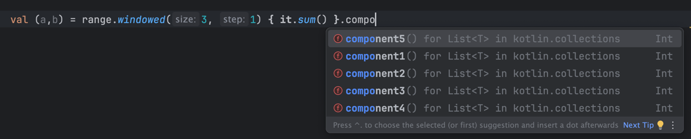

# 컬렉션을 윈도우로 처리하기

- windowed는 컬렉션을 횡단하는 방법이다.
  - 정해진 간격으로 컬렉션을 따라 움직이는 블록
- chunked는 컬렉션을 주어진 크기 또는 그보다 더 작게 분할한다.

### [chuncked]

```kotlin
fun main() {
    val range = 0..13

    val chunked = range.chunked(3)
    chunked.forEach {
        println(it)
    }
}
>> 출력
[0, 1, 2]
[3, 4, 5]
[6, 7, 8]
[9, 10, 11]
[12, 13]
```

- [0, 13] 범위를 3개의 연속된 그룹으로 나눴다.
- chuncked의 시그니처는 아래와 같다.

```kotlin
@SinceKotlin("1.2")
public fun <T> Iterable<T>.chunked(size: Int): List<List<T>> {
    return windowed(size, size, partialWindows = true)
}

@SinceKotlin("1.2")
public fun <T, R> Iterable<T>.chunked(size: Int, transform: (List<T>) -> R): List<R> {
    return windowed(size, size, partialWindows = true, transform = transform)
}
```

- 매개변수 size는 분할 시 안쪽 리스트의 크기
- transfrom 람다를 전달하면, 안쪽 리스트에 transform 함수를 적용 해 하나의 결과를 만들고, 이 결과의 리스트를 반환한다.
  - transform: (List<T>) -> R

```kotlin
fun main() {
    val range = 0..13

    val chunked = range.chunked(3) { it.sum() }
    chunked.forEach {
        println(it)
    }
}
>> 출력

3
12
21
30
25
```

- chuncked는 windowed의 특별한 경우라고 생각하면 된다.

### [windowed 함수]

- 우선 transform 인자가 없는 경우

```kotlin
public fun <T> Iterable<T>.windowed(size: Int, step: Int = 1, partialWindows: Boolean = false): List<List<T>>
```

- 각 매개변수에 대한 설명은 아래와 같다.
  - size: 각 윈도우에 포함될 원소의 개수
  - step: 각 단계마다 전진할 원소의 개수
  - partailWindows: 수신 객체의 나눠진 마지막 부분이 윈도우에 필요한 만큼 원소 개수를 갖지 못한 경우, 윈도우를 만들 것인지 아닌지 여부

```kotlin
fun main() {
    val range = 0..13

    range.windowed(3, 3).forEach {
        println(it)
    }
}
>> 출력
[0, 1, 2]
[3, 4, 5]
[6, 7, 8]
[9, 10, 11]
```

- 마지막 부분이 [12,13]으로 원소의 개수가 2개라 부족해, 윈도우를 만들지 않았음
- chuncked 함수는 size와 step의 값을 동일하게 하는 특별한 경우임을 확인할 수 있다.

```kotlin
package com.g2s

fun main() {
    val range = 0..13

    range.windowed(3, 1) { it.sum() }.forEach {
        println(it)
    }
}
>> 출력
3
6
9
12
15
18
21
24
27
30
33
36
```

- 윈도우: [0,1,2], [1,2,3] ... [11,12,13]
- transfrom 적용 후 [3], [6] ... [36]

-chuncked와 windowed 함수는 시계열 데이터를 단계별로 처리하는데 유용하다.

```c++
val (a,b) = range.windowed(3, 1) { it.sum() }
```



- 컬렉션의 componentN함수가 구현되어 있기 때문에 구조 분해 선언이 가능하다.


