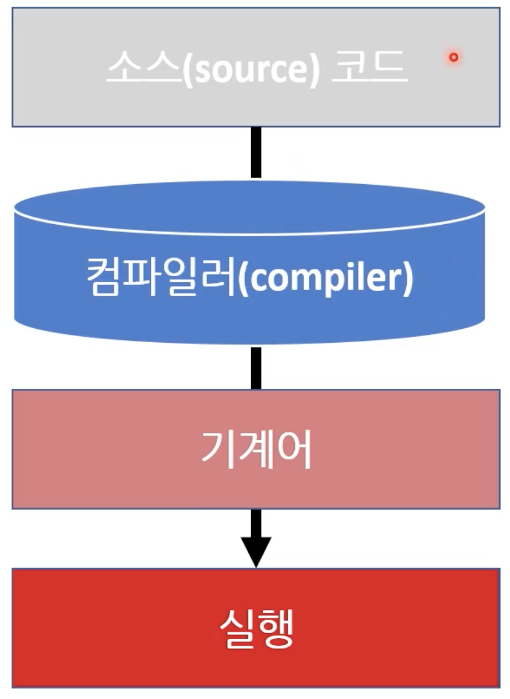
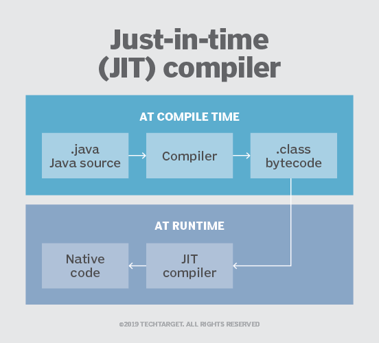

# Week1

## 왜 C#인가요?

### C#은 입문자에게 적합한 최고의 주류 언어

- 간결하다.
- C#을 사용할 때 사용자는 실수를 하기 어렵다.
- 뛰어난 개발 환경을 가지고 있다.
- [뛰어난 설명서(documentation)](https://learn.microsoft.com/ko-kr/dotnet/csharp/programming-guide/)을 가지고 있다.
- 다른 프로그래밍 언어의 미래상을 제공한다. 대표적으로 async await가 있다.

### C#을 사용할 수 있는 프레임워크가 존재

- .NET 프레임워크(OLD) VS .NET Core(NEW)
- .NET Core은 리눅스나 맥에서도 잘 돌아간다.

### 객체지향 언어(단점)

## C#은 어디에서 쓰이나요?

- 윈도우 어플리케이션
- 웹
- 게임 엔진
- 모바일 어플리케이션

## OOP를 무시하고 C#을 사용하기

- 모든 곳에서 static을 사용한다.
- . 이나 new 등 무시한다.

## Hello World

### Hello World 출력하기

```<C#>
using System;

namespace HelloWorld
{
	class Program
	{
		static void Main(string[] args)
		{
			Console.WriteLine("Hello World!");
		}
	}
}

```

## 프로그래밍 언어 분류

언어 분류를 하면 어떤 점이 좋을까? 언어를 어떻게 활용할지 가늠할 때 도움이 된다. 이는 실무에서 언어를 선택할 때 유용하다.

## 저수준 언어 vs 고수준 언어

어느 정도 주관적인 부분이 있다는 것을 감안해야한다.

### 고수준이 더 좋다는 의미가 아님

|           저수준 언어(low level language)           |              고수준 언어(high level language)              |
| :-------------------------------------------------: | :--------------------------------------------------------: |
|             컴퓨터가 이해하기 쉬운 언어             |                 인간이 이해하기 쉬운 언어                  |
|                 0과 1로만 이루어짐                  |     인간이 사용하는 언어로 이루어짐 EX) for, while,if      |
|                기계어(maching code)                 |                  어셈블리어,C,C++,Java,C#                  |
| 컴퓨터가 바로 이해하기 때문에 변환 과정이 필요없다. | 컴퓨터가 이해할 수 있는 기계어로 변환하는 과정이 필요하다. |

- 컴퓨터가 이해하기 쉬울수록 저수준
- 인간이 이해하기 쉬울수록 고수준
- 저수준이냐 고수준이냐 기준은 상대적이다.

### 컴퓨터가 이해하는 것

- 기계어
  - 네이티브 코드(native code)라고 불리는 기계어만 컴퓨터는 이해할 수 있다.
  - 기계어는 이진수다. 0과 1로 이루어져있다. 이는 디지털 방식(전류의 on/off)에 따라 컴퓨터가 설계된 것과 관련이 있다.

### 컴퓨터는 모든 것을 0과 1로 이해한다.

- 예시

  - 1 -> 1
  - 3 -> 11
  - 3 + 4 -> 1011010100......

- 기계어는 정말 사람이 이해하기 어렵다.

### 사람에게 친근한 어셈블리어(Assembly Language)

- 예시

  - MOV R1, 3 (3을 R1에 저장)
  - MOV R2, 4 (4을 R2에 저장)
  - ADD R1, R2 (R1과 R2의 값을 더한 후 그 결과를 R1에 저장)
  - MUL R1, R2 (R1과 R2의 값을 곱한 후 그 결과를 R1에 저장)

- 사람이 읽기에 편해졌다.
- 엄밀히 말하면 기계어에 비해서 고수준언어라고 할 수 있다.
- 어셈블리어의 **대부분**은 기계어에 대응된다.

### 고수준 프로그래밍 언어

- 어셈블리어보다 더 사람이 읽기 편하다.

- 예시

  - int addResult = 3 + 4;
  - int mulResult = 3 \* 4;

- 어셈블리어와 다르게 기계어와 일대일 대응이 불가능
- 메모리를 누가 관리하냐에 따라 매니지드 언어, 언매니지드 언어로 나눌 수 있다.

## 컴파일 언어 vs 인터프리터 언어

- 이 둘을 구분짓는 가장 큰 특징 혹은 차이점 때문에 일어나는 현상은 `곧바로 실행하냐 vs 실행 전 어떤 단계를 거치냐`이다.

### 컴파일 언어



- 실행할 때는 기계어로 이루어진 프로그램을 실행한다. 즉 실행 단계에서는 아래의 2개 단계만 왔다 갔다 하게된다.
- 컴파일러의 역할은 소스 코드를 기계어로 바꾸는 것이다.
- C, C++가 대표적인 컴파일 언어다. 컴파일 언어의 장점은 무엇일까? C, C++를 가장 많이 사용하는 곳은 운영체제, 영상처리, 게임, 머신러닝 최적화 등이 있다. 단순히 예시로는 감이 잘 오지 않는다. 결론적으로 컴파일 언어의 장점은 `최적화`이다. 따라서 컴파일 시간이 길어지더라도 실행 속도는 굉장히 줄일 수 있다. 따라서 개발 도중 최적화를 할 수 있고, 최적 사용자는 빠른 속도를 즐길 수 있다.
- 플랫폼마다(Ex: Mac OS, 32 bit windows, 아이폰 등) CPU, 운영체제가 다르다. 따라서 플랫폼마다 이해할 수 있는 기계어도 다르다! 따라서 내가 소프트웨어를 판매하는 사람이라고 생각하면 플랫폼 마다 다른 exe 실행파일을 컴파일해서 전달해야한다. (이렇게 미리 인터넷 통신 없이 오프라인에서 컴파일해서 넘기는 방식에서 사용하는 컴파일러를 오프라인 컴파일러라고 부른다.)

### JIT(Just-In-Time) 컴파일 언어

- 컴파일 언어와 인터프리터 언어의 중간 단계 하이브리드라고 생각하면 된다.
  
- 컴파일 언어와 다르게 컴파일러는 소스코드를 `중간언어(intermediate language`로 변환한다. 중간언어와 기계어는 다르다. 중간언어를 컴퓨터는 이해할 수 없다. 그러면 도대체 중간언어는 누가 이해하고 사용하는가? 이 때 `가상머신`의 개념이 등장한다.
- 정리를 해보자. 최종적으로 고객이 프로그램을 사용할 때 이 프로그램은 중간언어로 이루어진 exe에 준하는 파일이다. 고객이 이를 실행하면 가상머신이 Just in time하게(딱 필요할 때) 기계어로 컴파일하고 실행시킨다. 왜 이렇게 복잡한 일을 할까요??
- C#, Java, WASM 등이 JIT 컴파일 언어다. 이들의 특징은 플랫폼 별로 VM을 설치해야한다. 따라서 VM에 종속적인 언어다. 플랫폼에는 종속적이지 않다는 장점이있다! 물론 가상머신은 플랫폼 별로 다르겠죠? (EX: windows용 JVM, MAC OS JVM 등)

#### 가상 머신

- Virtual Maching A.K.A VM
- 기계(컴퓨터)가 아니라 프로그램으로 짜여진 기계를 말한다. 즉 기계처럼 돌게 프로그램을 짜놓은 것이다.
- 가상 머신은 실행 도중에 중간 언어를 기계어로 변환한다.

### 인터프리터 언어


- 소스코드를 인터프리터가 실행 중 기계어로 변환한다. 근데 이 변환도 애매한 표현이다. 왜? 컴파일러가 기계어로 하나하나 번역하는 방식과 다르게, 어떤 기계어들로 이루어진 집합(대표적으로 함수가 있다.)으로 번역하게 된다. 그리고 이 기계어들로 이루어진 집합이 실행된다.
- Javsscript, Python, PHP 등이 있다.
- 실제로 실행하기 전까지 코드의 문제를 잡아낼 수 없다는 단점이 있다.
