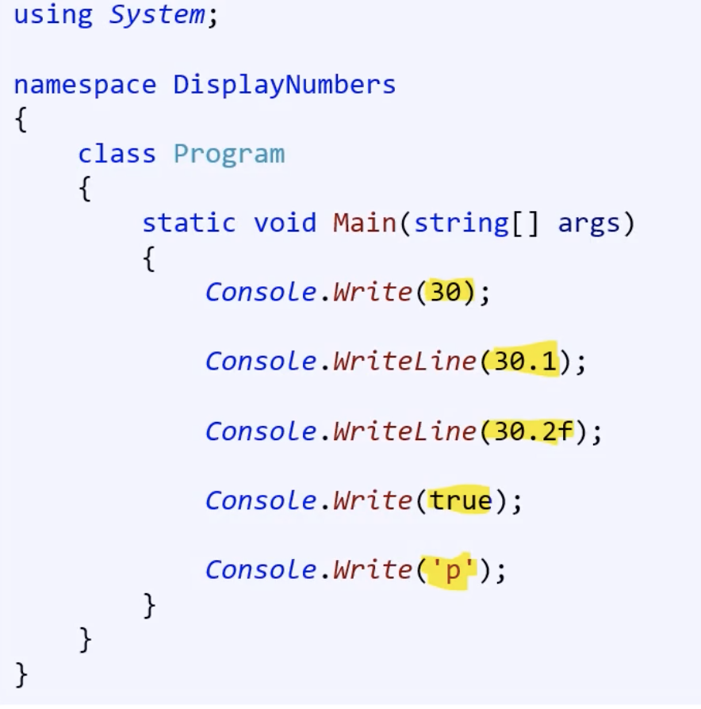
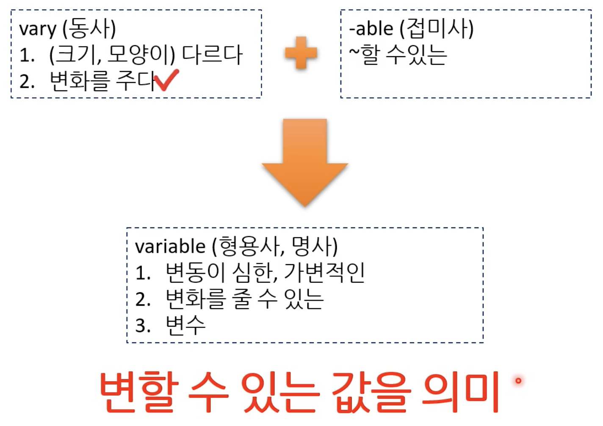
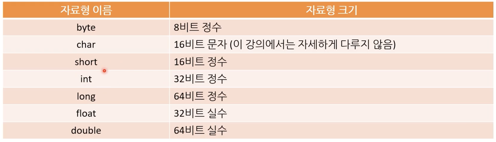
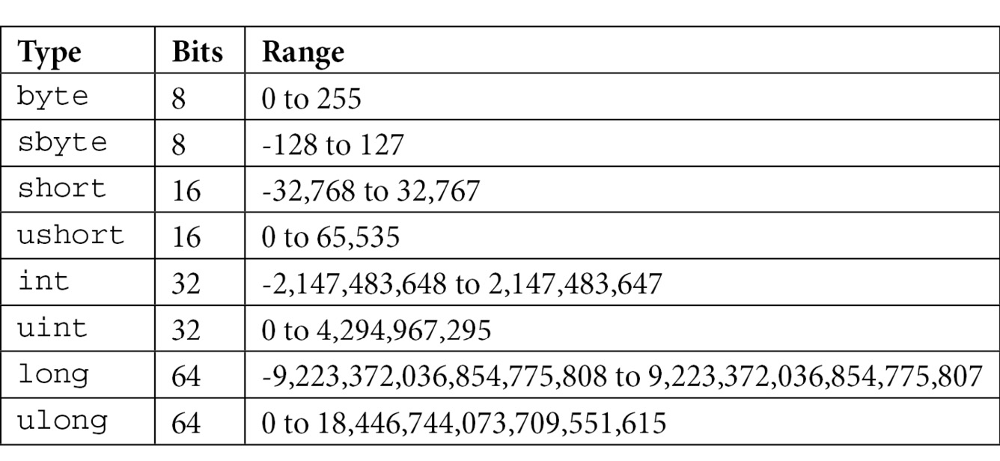
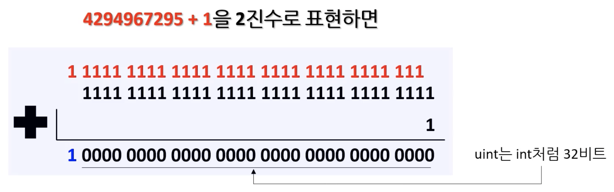

# Week2

## 메인함수

```<c#>
using System;

namespace HelloWorld
{
	class Program
	{
		static void Main(string[] args)
		{
			Console.WriteLine("Hello World!");
		}
	}
}
```

- 메인함수는 Entry Point 즉 `시작점`이라고 표현한다. C# 프로그램은 반드시 어떤 함수로 부터 실행되어야 하는데 그 어떤 함수가 바로 Main 함수다.

- 실행파일(exe 파일)을 실행하면 이 메인 함수가 실행된다.

- 컴퓨터가 프로그램을 실행할 때 어디부터 코드를 실행해야하는지 알려주기 위함이다. 메인 함수를 가장 먼저 시작하게 된다. 어떤 언어를 사용하던 컴파일 언어는 대게 Entry Point로 메인 함수를 사용한다.

### static

- 전역 함수가 된다.
  - 즉 프로그램에서 오직 하나만 실행된다.
  - 프로그램이 실행될 때 어디서든 접근할 수 있다.
- OOP와 상관 없어진다.

### string[] args

- 메인 함수가 외부로 받는 데이터
  - 이것을 함수 인자(function argument/parameter)로 부른다.
  - 메서드 인자라고도 부른다.
- 데이터를 받는 방법은 커맨드 라인으로 부터 받는다. 이 때 커맨드 라인 인자가 string[] args로 저장되어 메인 함수에서 사용된다.

### 반환형(return type)

- `모든 함수는 반환형이 존재한다.`
- 하지만 실제로 값을 반환할 수도 있고, 아닐 수도 있다.
  - 값을 반환하지 않을 때 void를 사용한다.
- 메인 함수의 경우 정수 값을 반환하게 할 수 있다. 이럴 때는 반환형으로 `int`를 사용하고 `return`이라는 키워드를 사용한다.
  - 메인 함수에서 반환형의 역할은 exe 프로그램이 올바르게 실행됬는지 여부를 알려준다.
    - 0 : 대부분의 경우 성공을 의미한다.
    - 0이 아닌값 : 오류 코드
      - 이 오류 코드는 프로그램마다 굉장히 다양하고, 보통 사용제에게 메뉴얼로 오류 코드가 무엇을 의미하는지 알려준다.

```<c#>
static int Main(string[] args)
		{
			return 0;
		}
```

## Console.WriteLien();

- 화면에 글자를 출력할 때 사용하는 함수
  - 함수는 어떤 기능을 해주는 코드의 집합이다.

### console

- 콘솔
- 제어장치
- 모니터링 장치
- 컴퓨터에서는 명령 프롬프트 창이 콘솔이다.

### writeline

- 한 줄을 쓴다.

### 합치면

명령 프롬프트에 한 줄을 쓰고, 그 내용은 HelloWorld!

## Using System

- System에서 S가 대문자다.
- 겨

### Using 지시어(directive)

- using을 C#에서는 지시어라고 한다.
- using System을 없에고 빌드하면 오류가 발생한다.
  - Console이 컨텍스트에 없습니다.
- using 지시어 다음에는 우리가 사용할 `라이브러리` 이름을 넣는다.

### 라이브러리(Library)

- 함수를 하나로 모아 놓은 집합
- C#에서는 namepspace, Java는 package라고 부른다.

결론적으로 System 라이브러리의 Console을 사용한다.

## 컴파일(Compile)

- 소스코드를 기계 또는 VM이 이해할 수 있는 언어로 변경하는 행위
- 컴파일러라는 프로그램을 사용한다.
- 컴파일 할 때, 오류(error) 또는 경고(warning)이 발생할 수 있다.
  - 컴파일 언어의 장점을 생각해야 합니다. 즉 프로그래머의 실수를 예방한다.

### 컴파일 오류

- 작성한 코드가 프로그래밍 언어의 규격에 위반되는 경우
- 오류가 있을 경우, `exe 파일이 생성되지도 않음!`
- 따라서 프로그램을 실행할 수 없다. exe 파일이 없으니까!
- 컴파일 오류는 프로그램 실행 중에 문제를 발견하는 것보다 이득이다.
  - 프로그램이 실행 중 문제가 생기면, 문제를 버그라고 부른다.
  - 버그가 나는 상황을 프로그래머가 직접 재현해야 한다.
  - 버그를 재현한 후에는 프로그래머가 머리를 잘 굴려 고쳐야한다.

### 컴파일 경고

- 오류와 다르게 경고가 있더라도 exe파일은 생성된다.
- 따라서 프로그램을 실행할 수 있다.
- 즉 프로그래머의 실수를 똑똑한 컴파일러가 잡아준 것이다.
- 실제로는 문제가 아닌 경우가 보통이다. 10%정도 실제 문제가 될 수 있다.
- 따라서 이 10%를 잘 찾기 위해 경고는 미리미리 해결해서 고치자!

### 디버그(debug) 빌드와 릴리즈(release) 빌드

- 디버그 빌드는 개발 중 사용하는 빌드 파일이다.
  - 디버깅에 유용한 정보가 많이 포함되어 있다.
  - 최적화가 상대적으로 덜 되어있다.
  - 따라서 성능이 상대적으로 별로다.
- 릴리즈 빌드는 실제 사용자(고객)에게 배포하는 실행 파일이다.
  - 디버깅을 위한 정보는 적다.
  - 최적화 만빵
  - 성능이 상대적으로 좋다. (컴파일러가 해준다.)

이 모드는 컴파일러에서 해주는 것이기 때문에 `코드는 그대로 변경할 필요가 없다.` 그저 개발자는 모드 전환만 해주면 컴파일러가 알아서 인식해서 해당 모드에 맞게 컴파일 해준다.

## 여러 값을 출력하기

### 구문(statement)

직관적인 의미는 명령을 내리는 단위이다. 구체적인 코드에서 형태는 아래와 같다.

- 한 줄짜리 코드 : 보통 이 경우 끝에 ;가 있다.

```<C#>
Console.WriteLine(30.2f);

Console.Write(true);
```

- 여러 줄의 코드로 이루어진 블록(block)
  - 범위(scope)라고 부른다.
  - 이 경우 코드를 중괄호로 감싼다.

```<C#>
if (symbol == true)
{
    Console.WriteLine("hi");
    Console.WriteLine("hello");
}
```

### 주석(comment)

- 코드와 관련된 내용을 메모할 때 사용한다.
- 컴파일 할 때 무시되는 문장
- 주식 처리가 되면 실행이 되지 않는다.
- 주석을 처리할 때 commnet in이라고 하고, 주석을 해제할 때 comment out이라고 한다.

### 주석은 너무 지나치게 사용하면 안 된다

- 주석은 적을 수록 좋은 코드다.
- 반드시 필요한 내용만 주석에 포함하자(예를 들어 다른 사람이 모르는 비즈니스 개념이 포함된 경우)

## 상수

상수의 개념은 변하지 않는 숫자다. 영어로 literal이라고 부른다. 또는 magic numbers라고 부른다.


- 컴퓨터 입장에서 절대 변하지 않는 값이다.
- 사람이 읽었을 때 숫자 뿐만 아니라 문자도 포함된다. (위 예시에서 노란색 형광팬 표시)

### 상수가 왜 매직넘버인가요?

- 마치 마법처럼 전혀 알 수 없기 때문이다.
- 문자 메시지에서 17만 적혀있다면, 나이인지, 과일 개수인지 뭔지 어떻게 아나요? 마법처럼 다양하게 해석될 수 있다.
- 게다가 수정도 어렵다...
- 매직 넘버는 최대한 쓰지 말자!

## 변수란?

절차적 프로그래밍에서 상태르 저장하는 곳을 따로 둔다고 했는데 그것이 변수다.

### 선언(Declaration)과 대입(Assignment)

```<C#>
static void Main(string[] args)
    {
        float num1; // declare a variable
        num1 = 128.512f; // assign a value to the variable

        float num2 = 123.456f; // declare and assign a variable

        const float PI = 3.14f; // declare and assign a constant, 상수는 항상 선언과 대입이 동시에 이뤄짐
    }
```

- 선언(다른 말로 정의:definition)은 변수의 자료형(float)과 이름(num1)을 컴퓨터에게 알려주는 것이다.
- 대입은 변수의 실제 값을 컴퓨터에게 알려주는 것이다.
- 선언과 대입을 동시에 할 수 있다.
- 상수(한번 대입하면 더 이상 변하지 않는 변수, Literal과 다르다.)는 항상 선언과 대입이 동시에 이뤄진다.
  - 참고로 상수는 대문자로 적어준다.

### 다시 변수의 정의



변수에서 수라고 숫자만 의미하는 것은 아니다. 'c' 같은 문자나 "hello"같은 문자열도 포함된다.

### 왜 변수가 필요한가?

- 어딘 가에 저장한 값을 다시 재사용하기 위해서
- 재사용 하면 값이 변하겠죠? 따라서 mutable이라고 부릅니다.
- 반면 상수는 절대 바뀌지 않기 때문에 immutable이라고 부른다.
- `핵심은 코드의 재사용성을 높일 수 있다.`

### 매직넘버의 단점을 극복하고 읽기 쉬운 코드를 만들자

int age = 17; 이라고 하면, 그냥 Console.WriteLine(17)보다 Console.WriteLine(age) 했을 때 나이를 출력하는 것을 명확하게 보일 수 있겠죠?

## 변수명 짓기 팁, const 키워드

### 변수명은 의미있게 짓자

a,b 이렇게 짓지말죠. 변수명에서 각 데이터가 무엇을 의미하는지 남이 봤을 때 알 수 있도록 하자!!

### 코딩 스탠다드

- 명사로 정확하게 짓자.
  - 성적 : score
- 여러 명사가 들어간다면 두번째 단어의 첫 글자는 대문자로 쓰자.
  - 수학 성적 : mathScore
- 이런 방식을 camelCasing이라고 한다.

### Const 키워드

- constant의 줄임말이다. 즉 상수를 의미한다. 매직 넘버가 아니라 변하지 않는 변수(?)라고 생각하면 된다.
- 한번 값을 대입 한 후에 값을 바꾸지 않고 싶을 때 사용한다.
- 대입 후 값을 변경할 경우 `컴파일 오류`가 발생한다.

```<C#>
const float pi = 3.14f; // declare and assign a constant, 상수는 항상 선언과 대입이 동시에 이뤄짐

pi = 231.12f    // 컴파일 오류 : 상수는 값을 변경할 수 없음
```

## 기본 자료형(Primitive Types) 소개

- 하드웨어에서 이해할 수 있는 자료라서 `기본`이라는 표현을 사용한다.
- 다른 언어에서는 built-in type이라고 표현하기도 한다.

### 기본 자료형의 개념

- 컴퓨터가 이해할 수 있는 가장 자연스러운 형태의 데이터
- 전부 숫자다.
- 기본적으로 0과 1로 이뤄져있다.

### 자료의 크기

- 최소 단위는 bit
  - 1과 0중 하나만 담을 수 있다.
- 8비트가 모이면 byte
  - 각각 비트에는 마찬가지로 1과 0중 하나만 담을 수 있다.
- 1024 바이트가 보이면 킬로바이트(KB)
- 1024 킬로바이트가 모이면 메가바이트(MB)

### 정수형(Integer Type)

- 0, 1, 2, 3을 담을 수 있는 정수형
- 프로그래밍 언어마다 담을 수 있는 자료의 크기 차이는 존재한다.

### 부동소수점형(Floating-Point Type)

- 3.14, 0.9같은 정수가 아닌 실수를 담을 수 있는 자료형
- 마찬가지로 프로그래밍 언어마다 담을 수 있는 자료의 크기 차이는 존재한다.

### 문자형(Character Type)

- 하나의 문자를 담는 자료형
  - 알파벳, 숫자, 특수문자 등등
  - 문자를 감쌀 때 작은 따옴표 사용

### 불리언형(Boolean Type)

- 참(true)와 거짓(false)를 표현하는 자료형
- C++ 같은 언어는 false를 0 true를 0이외의 수로 변환이 가능하다.

### C#에서 기본 자료형



## 각 자료형에서 비트수가 다른 이유

- 이진수의 자릿수가 컴퓨터의 데이터 단위인 비트라고 생각하면 된다.
- 거꾸로 생각해보면 컴퓨터가 10진수를 이해할 수 있다면 비트 단위가 아니라 0~9를 담을 수 있는 어떤 단위를 사용하겠죠?
- 중복 순열 생각해서 2의 비트 수 승 만큼 숫자를 표현할 수 있다.
  - 32비트 컴퓨터라면 2의 32승이니까 4 billion 즉 4기가 메모리를 설치 할 수 있다. 이런 계산도 할 수 있습니당.

### 음수도 표현할 수 있다

- 1바이트에서 음수 양수를 분배해보자.
- 깔끔하게 반반가죠!
- 맨 왼쪽의 비트를 양수인지 음수인지 구분하게 사용하고 7비트를 수의 절대값을 표현할 때 사용한다.
  - 그래서 최상위 비트를 sign bit라고 부릅니다.

## 부호 있는 자료형, 부호 없는 자료형



- 보통 부호 없는 자료형에 u가 붙는다.

- 특이한 것은 byte이다 byte는 ubyte가 존재하지 않고 원래 byte가 부호 없는 자료형이다.

### 왜 byte는 특이한가요?

- 이를 알기 위해서는 문자형(char)의 역사를 살펴봐야한다.

  - 논리적이지는 않고, 상식적으로 이해할 수 있다.

- 사람들끼리 각 문자를 숫자와 1대1 대응하기러 약속했습니다. 그 약속이 [ASCII](https://ko.wikipedia.org/wiki/ASCII)죠?
  - 아스키는 처음에 0부터 127까지 7비트로 충분했습니다. 1비트가 남았죠.
  - 나중에 세계 각 국의 언어를 아스키에 추가했습니다. 확장 아스키라는 개념이 등장했죠.
  - 128부터 2진수로 표현하면 가장 왼쪽 부호 비트자리에 숫자 1을 넣어야합니다. 따라서 문자열을 음수로 표현해야하는 문제(?)가 생겼습니다. 사람들은 문자를 음수에 대응하는 것을 동의하지 않았고 모두 양수에 대응했습니다.
- 결론적으로 byte는 문자를 대응하는 자료형이기 때문에 모두 양수입니다. 따라서 오히려 부호를 가지는 signed byte인 sbyte가 따로 생겼습니다.

## 자료형을 언제 쓸까?

- 프로그래머의 명백한 의도를 보여주는 것이 변수입니다.
  - 예를들어 int age = 17; 이건 좀... 나이가 음수이면 이상하죠?

### 오버플로우

```<C#>
static void Main(string[] args)
    {
        uint num1 = UInt32.MaxValue; // 4294967295
        uint num2 = 1;
        uint result = num1 + num2;
        Console.WriteLine(result); // 0
    }
```

- uint의 최대값에 1을 더하면 컴퓨터에서는 0이됩니다.
- uint가 저장할 수 있는 공간은 32비트 인데 실제 계산된 값은 33비트죠? 따라서 최상위 비트가 잘리게됩니다.
  

- 연산의 결과로 자료형이 담을 수 있는 수 보다 큰 수가 나오는 경우를 말한다.
- 자료형의 크기(비트로 계산된 크기)는 변하지 않기에, 담을 수 있는 수도 고정적이다. 따라서 넘는 수는 비트로 계산해서 버리게 된다.
- 이 때문에 원하지 않는 수가 나올 수 있다.

### 변수의 자료형을 선택할 때 주의점

- 변수의 역할(사람의 이해에 따른 역할이죠?)에 알맞은 자료형을 택하자.
- 오버플로우를 고려해서 자료형을 선택할 것!

## 상수의 접두사와 접미사

우리가 스스로 컴퓨터라고 상상해보자. 상수(literal) 10은 도대체 무엇일까? 자료형에 따라 어떻게 표현할지 달라지겠죠?

```<C#>
static void Main(string[] args)
    {
        int intNum = 10;
        int binaryNum = 0b10;
        int hexNum = 0x10;
        uint uIntNum = 10u;
        float floatNum = 10.0f;
        double doubleNum = 10.0;
        string stringNum = "10";

        Console.WriteLine($"intNum: {intNum}");
        Console.WriteLine($"binaryNum: {binaryNum}");
        Console.WriteLine($"hexNum: {hexNum}");
        Console.WriteLine($"uIntNum: {uIntNum}");
        Console.WriteLine($"floatNum: {floatNum}");
        Console.WriteLine($"doubleNum: {doubleNum}");
        Console.WriteLine($"stringNum: {stringNum}");
    }
```

```<console>
intNum: 10
binaryNum: 2
hexNum: 16
uIntNum: 10
floatNum: 10
doubleNum: 10
stringNum: 10
```

위에서 볼 수 있듯이 literal에 접두사, 접미사를 붙여서 컴퓨터에게 알려줄 수 있습니다. 즉 접두사와 접미사를 통해서 상수에 대한 추가적인 정보를 컴퓨터에 알려줄 수 있다는 말이죠!

### 상수 접두사

- 접두사는 진법을 나타낸다.
  - 2진수 : 0b10;
  - 16진수 : 0x10;

### 상수 접미사

- 접미사는 상수의 형(자료형)을 나타낸다.
  - float : 10.0f;
    - float num = 10.0; // 컴파일 오류(double을 float에 구겨넣으려 했기 때문이다.)
  - double : 10.0d;
