# Week3

## 묵시적 변환(Implicit Conversion)

묵시적이라는 단어의 의미를 생각해보자. 무언가 자동적으로 변환해준다는 의미? 알아서 해준다는 느낌을 상상하자.

### 묵시적 형 변환이란

- `기본 자료형` 간의 변환을 컴파일러가 `알아서` 해준다.
  - 다만 모든 기본 자료형의 변환이 가능한 것은 아니다.
- 특별한 문법이 필요하지 않다. 즉 프로그래머에게 특별한 요구사항이 없다는 말이죠!

```<C#>
int num1 = 100000;
long num2 = num1;
```

#### 형 변환 테이블

[공식 문서](https://learn.microsoft.com/en-us/dotnet/csharp/language-reference/builtin-types/numeric-conversions)를 참고하자.

int -> float로 변환하면 자료의 손실이 있을 수 있다는 점을 기억하자.
언어마다 컴파일러에 따라서 자료의 손실이 발생하는 케이스도 각기 다르다.

```<C#>
using System;

namespace LossPrecisionExample;

public class Program
{
    static void Main(string[] args)
    {
        int num1 = 1234567890;
        // int -> float implicit conversion
        float num2 = num1;

        // float num2 = 1234567890f 를 int로 변환
        Console.WriteLine(num1 - (int)num2);
    }
}

>> 출력
-46
```

출력 결과를 보면 float이 되었다가 다시 int로 돌아오면 값이 커진다는 것을 확인할 수 있다.
여튼 결론은 int to float 변환하면 `정밀도 손실`이 발생한다는 것이다.

#### 정밀도 손실

- 아래의 경우 자료의 값이 달라질 수 있다.
  - int/long 에서 float으로 변환
  - long에서 double로 변환
  - 정수에서 실수로 변환하면 정밀도 손실이 발생한다.

### 승격(Promotion)

- 컴파일러가 자동으로 실수형이나 부동소수형 자료의 이진 표현을 확장하는 것을 말한다.

```<C#>
public class Program
{
    static void Main(string[] args)
    {
        double num1 = 12.3;
        int num2 = 23;

        Console.WriteLine(num1 + num2);
    }
}
```

정수 + 실수 했을 때 실수가 된다.

### 작은 형에서 큰 형으로 변환(크기 기준)

- int -> long 변환은 당연히 문제가 없다.

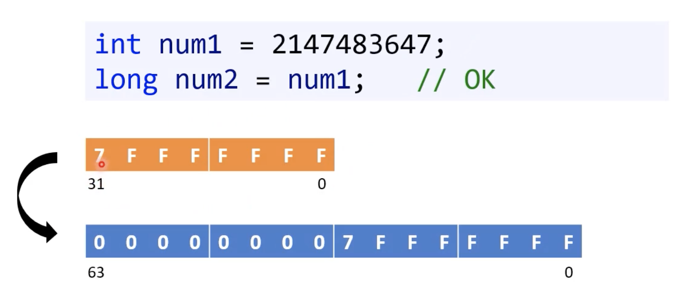

### 큰 형에서 작은 형으로 변환(크기 기준)

- 값이 충분히 작아서 변환 후의 형이 충분히 담을 수 있는 값이라면 문제가 되지 않는다.
- 그러나 어떤 프로그래밍 언어는 변환을 못하게 할 수 도 있다.
  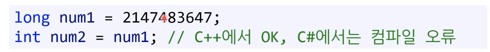
  C#에서는 값이 충분히 크다면 잘릴 수 있다고 `컴파일 오류`를 내준다.

- 값이 크다면 `정보의 손실`이 발생한다.

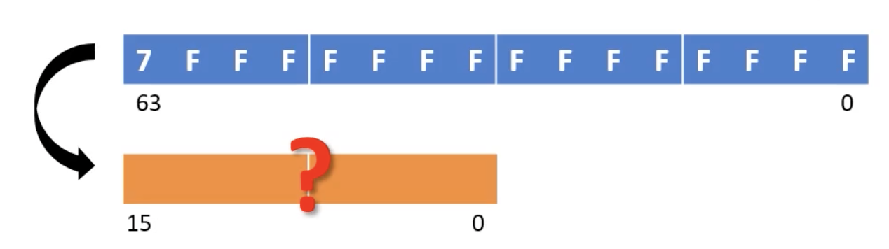

- 그렇다면 long -> int는 불가능한가요?
  - 아뇨 `명시적 형변환`을 사용하면 됩니다.

## 명시적 변환

### double -> int 명시적 변환

- 버림이 적용된다.

  - 10.09 -> 10
  - 52.16 -> 52

- 소괄호 안에 변화하고자 하는 자료형을 입력하면 된다.
  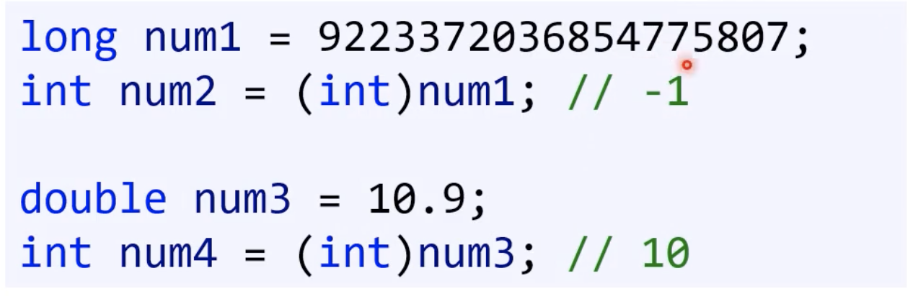

  - long -> int로 변환하면 비트 패턴에서 잘린다.
    - 양수 -> 음수가 되는 이유는 잘렸을 때 최상위 비트가 1이니까!
  - double -> int로 명시적 변환할 때는 컴파일러가 가장 가까운 정수로 내려서 계산해준다. 비트 패턴으로 자르는거 아님!

- 모든 자료형들이 변환되는 것은 아니다.
  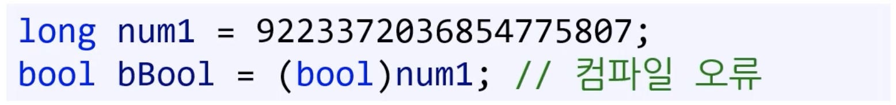
  - long -> bool은 허용하지 않아요.
  - 컴파일 오류가 발생한다.

```<C#>
using System;

namespace TypeConversion
{
    class Program
    {
        static void Main(string[] args)
        {
            char char1 = 'a';

            int int1 = char1;
            Console.WriteLine("int1: " + int1);

            long long1 = char1;
            Console.WriteLine("long1: " + long1);

            ulong ulong1 = char1;
            Console.WriteLine("ulong1: " + ulong1);

            float float1 = char1;
            Console.WriteLine("float1: " + float1);

            double double1 = char1;
            Console.WriteLine("double1: " + double1);

            long long2 = long.MaxValue;
            int long2ToInt = (int)long2;

            Console.WriteLine("long2: " + long2);
            Console.WriteLine("long2ToInt: " + long2ToInt);

            float float2 = 3.14159f;
            int float2ToInt = (int)float2;

            Console.WriteLine("float2: " + float2);
            Console.WriteLine("float2ToInt: " + float2ToInt);

            int int2 = -1;
            uint int2ToUInt = (uint)int2;

            Console.WriteLine("int2ToUInt: " + int2ToUInt);

        }
    }
}

```

위 코드를 안 보고 출력 결과를 알 수 있도록 연습하기

## 연산자

- 하나 이상의 피연산자를 가진다.
- 종류가 다양한다.

## 산술 연산자

- 더하기
- 빼기

  - 부호가 없는 피연산자끼리 빼서 음수가 나오면 `언더플로우`가 발생해서 매우 큰 수가 나오게된다.
    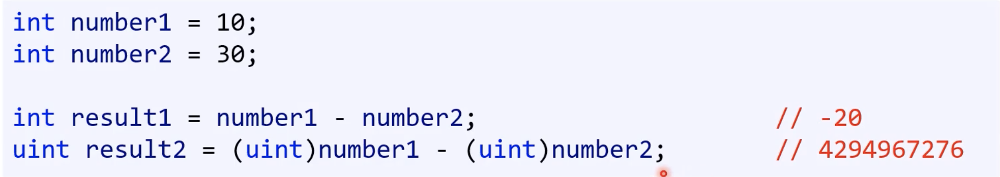

- 곱하기
- 나누기 연산자(/)
  - 정수형의 경우 몫의 연산이 된다.
  - 부동 소수점 형은 그대로!

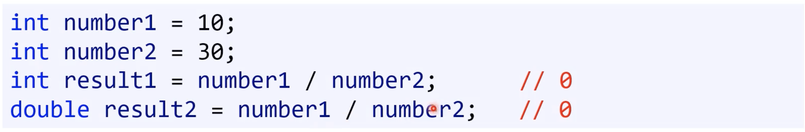

- int 인 0을 double에 대입해서 그대로 0이 나왔다.
- 올바르게 하려면? 명시적 형변환이 필요합니다.


- 위에서 number1, number2 둘다 명시적 형변환을 했는데, 둘 중 하나만 바꿔도 `승격` 때문에 의도한 형변환이 된다!

- Modula 연산자
  - 나머지를 구한다.
  - 주로 정수에 사용하죠.. 실수형에는 쓸 일이 없다고 봐야합니다.

```<C#>
using System;

namespace Calculator
{
    class Program
    {
        static void Main(string[] args)
        {
            int num1 = 10;
            int num2 = 11;

            int result1 = num1 + num2;
            int result2 = num1 - num2;

            Console.WriteLine("result1: " + result1);
            Console.WriteLine("result2: " + result2);

            uint result3 = (uint)num1 - (uint)num2;

            Console.WriteLine("result3: " + result3);

            int num3 = int.MaxValue;
            int result4 = num3 + 1;

            Console.WriteLine("result4: " + result4);

            float num4 = 2.3f;

            float result5 = num1 + num4;
            float result6 = num4 - num1;

            Console.WriteLine("result5: " + result5);
            Console.WriteLine("result6: " + result6);

            float result7 = num2 * num4;

            Console.WriteLine("result7: " + result7);

            float result8 = num2 / num1;
            float result9 = num2 / (float)num1;

            Console.WriteLine("result8: " + result8);
            Console.WriteLine("result9: " + result9);

            int result10 = num1 % num2;
            int result11 = num2 % num1;

            Console.WriteLine("result10: " + result10);
            Console.WriteLine("result11: " + result11);
        }
    }
}

```

이 코드로 복습하자.

## 증가 감소 연산자

### ++ 연산자

- 피연산자 하나의 값을 1증가 시킨다.
- 연산자를 변수의 앞이나 뒤에 붙일 수 있다.

#### 전위(prefix) vs 후위(postfix)

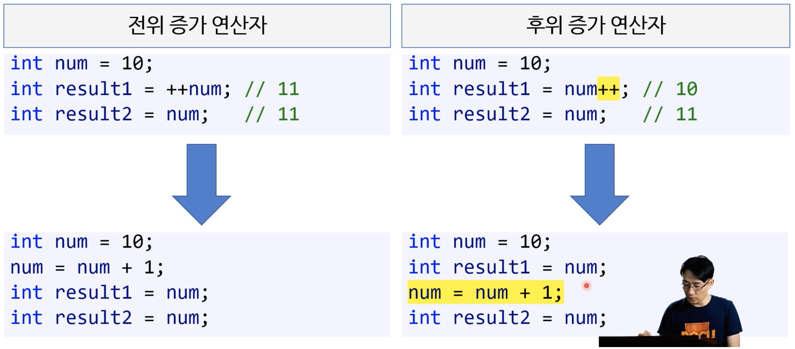

result1에 대입 후 증가하냐, 증가 후 대입하냐 차이

### -- 연산자

- ++ 연산자와 내용이 동일하다.

  - 전위, 후위 비교도 동일하다.

- 중요한 점은 증감 연산자는 `정수형`에만 쓰자. 상식적으로! 실무에서 부동소수점형에 쓰는 것을 본적이 없다.

```<C#>
using System;

namespace IncrementAndDecrementOperators
{
    class Program
    {
        static void Main(string[] args)
        {
            int num1 = 0;
            int num2 = 10;

            int result1 = num1++ + num2;

            Console.WriteLine("num1: " + num1);
            Console.WriteLine("num2: " + num2);
            Console.WriteLine("result1: " + result1);

            num1 = 0;
            num2 = 10;

            int result2 = ++num1 + num2++;

            Console.WriteLine("num1: " + num1);
            Console.WriteLine("num2: " + num2);
            Console.WriteLine("result2: " + result2);

            num1 = 0;
            num2 = 10;

            int result3 = num1-- + num1-- - --num2;

            Console.WriteLine("num1: " + num1);
            Console.WriteLine("num2: " + num2);
            Console.WriteLine("result3: " + result3);

            num1 = 0;
            num2 = 10;

            int result4 = num2++ * num1++ - --num2 + num1;

            Console.WriteLine("num1: " + num1);
            Console.WriteLine("num2: " + num2);
            Console.WriteLine("result4: " + result4);
        }
    }
}

```

까다로운 면접 용으로 대비하자!

## 비트 연산자(Bitwise)

이진수 피연산자를 비트 단위로`(비트 끼리)` 연산할 때 사용한다.
비트라는 개념이 사람에게 추상적이기 때문에 예시를 통해서 바로 파악하는 것이 쉽다.

### &(and)

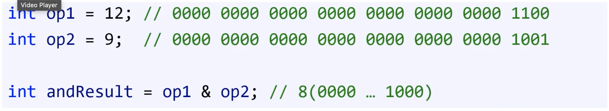
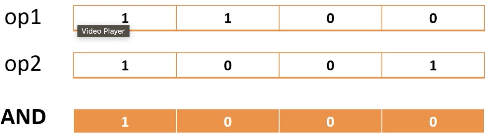

비트 끼리 연산하기 때문에 같은 위치(자리 수와 유사함)끼리 해당 연산을 하면 된다. and 연산은 두 비트 모두 켜져있어야 켜진다. 즉 1이다. 직렬 연결 생각하면 편하다.
다른 경우는 모두 0이다.

### |(or)

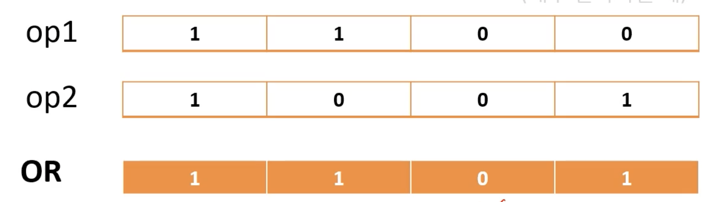
그러던가 말던가 ㅋ
둘 중 하나만 켜져있어도 켜진다. 둘다 꺼져있어야 0이다. 즉 두 비트 모두 0이여야 0이다. 다른 경우는 모두 1이다.

### ^(xor)

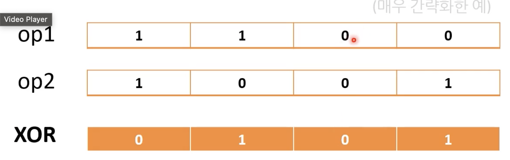
둘이 달라야만 켜있다고 생각한다. 참참참해서 살아남기 생각하자.
xor로 할 수 있는게 많은데, 숫자 교환하기도 할 수 있다!!

### ~(not)

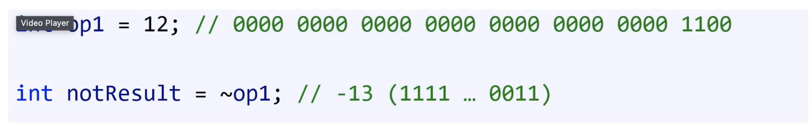
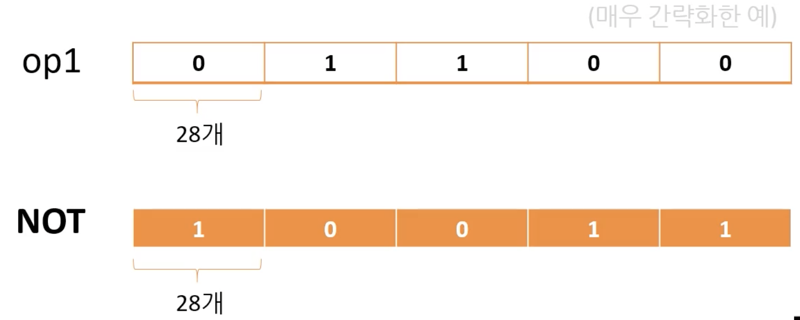

이 연산자는 피연산자가 하나다. 그럴 수 밖에 없는게 그냥 피연산자의 비트를 반전시키면 되기 때문이다.

## 비트 이동 연산자

비트를 shift한다. 왼쪽 혹은 오른쪽으로 움직일 수 있다. 하드웨어(CPU)에서 기본적으로 제공하는 연산자다.

### left-shift

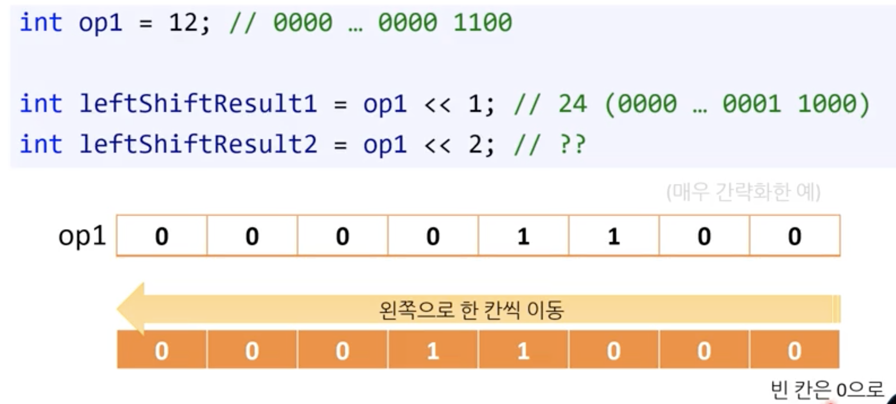

연산자의 문법은 왼쪽에 비트 피연산자, 오른쪽에 정수를 입력한다. 진짜 거의 대부분 언어에서는 오른쪽 정수에 양수를 쓰는 것을 권한다. 아참 그리고 중요한 것이 비트 쉬프트 연산자에서 우항에 정수가 아닌 수는 사용할 수 없다. 비트가 `가장 작은 단위`인데 비트를 소수점 처럼 쪼갠다? 말이 안 되죠? 그리고 좌항에 소수를 쓰는 것도 C#은 컴파일 에러를 냅니다!! `즉 정수를 대상으로만 비트 쉬프트 할 수 있다.`

왼쪽으로 비트가 밀리면서 해당 자료형이 담을 수 있는 비트를 넘어서는 비트는 밀려 떨어진다고 생각하면 된다. 1칸 왼쪽으로 밀면 int 자료형의 경우 가장 왼쪽 비트는 없어진다! 그리고 가장 오른쪽에 빈 칸이 생기는데 이건 0으로 채워진다.

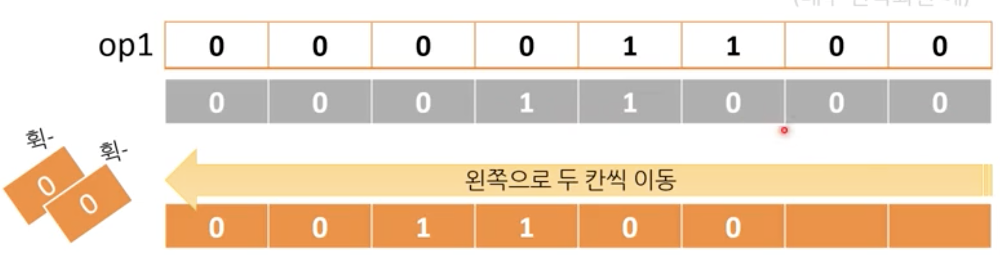
두 칸 밀어도 똑같이 적용하면 된다. left-shift는 `직관적으로 2배`한다고 생각하면 된다. 물론 왼쪽 비트들이 잘리는 상황에 따라 달라 질 수 있긴 한데, 12같은 작은 숫자는 2배하면 되겠죠?

### right-shift

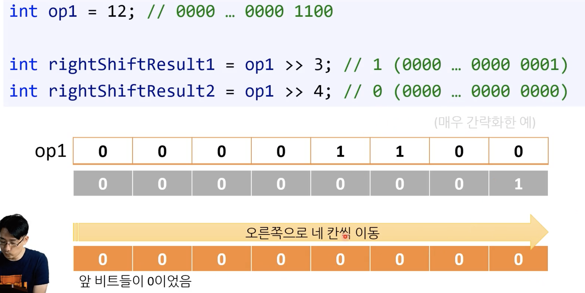
이제 반대로 오른쪽으로 밀어주면 된다. 밀린 비트는 잘려서 없어지고, 왼쪽에는 0으로 채운다. 이번에는 `2씩 나눈다`고 생각하면 된다. 몫을 구하는 연산자와 유사하다.

### bit flag

비트를 불리언 데이터로 생각해서 1이면 true, 0이면 false로 마치 flag처럼 사용하는 방식이다. 실습을 통해 bitflags와 bit masking을 알아보자.

- 특정 위치의 비트만 키는 법

  1. 1을 left-shift를 통해서 해당 위치의 비트만 1이 되게 마스크를 만든다.

  2. 기존의 값에 마스크를 bitwise or 연산을 한다.

- 특정 위치들의 비트만 키는 법

  1. 1을 left-shift해서 해당 위치의 비트만 1이되게 하고 각각을 bitwise or 연산으로 결합해 마스크를 만든다.

  2. 기존의 값에 마스크를 bitwise or 연산을 한다.

- 특정 위치의 비트만 끄는 법

  1. 1을 left-shift를 통해서 해당 위치 비트만 1이 되게 마스크를 만든다.

  2. 마스크를 bitwise not 연산으로 반전시킨다. 이제 해당 위치만 0이고 나머지 비트는 1이다.

  3. 기존의 값에 마스크를 bitwise and 연산을 한다.

- 모든 비트를 0으로 만드는 법

  - 0과 bitwise and 연산을 한다.

- 대문자를 소문자로 바꾸는법

  - ' '(space)랑 bitwise or연산을 한다. space의 아스키 코드 값이 32라서 비트패턴으로 0000...100000이다. 대문자 아무거나 해봐도 성립한다. 해보면 됨

- 소문자를 대문자로 바꾸는법
  - '\_'(언더바)와 bitwise and연산을 하면 된다.

```<C#>
class Program
    {
        static void Main(string[] args)
        {
            const int BIT_FLAG_SIZE = 8;

            // 00000000
            byte bitFlags = 0;

            // 00000100
            byte mask1 = 1 << 2;

            // 00000100
            bitFlags |= mask1;

            Console.WriteLine("bitFlags: " + Convert.ToString(bitFlags, 2).PadLeft(BIT_FLAG_SIZE, '0'));

            // 00101000
            byte mask3 = (1 << 3) | (1 << 5);

            // 00101100
            bitFlags |= mask3;

            Console.WriteLine("bitFlags: " + Convert.ToString(bitFlags, 2).PadLeft(BIT_FLAG_SIZE, '0'));

            // mask : 11111011
            // bifFlags : 00101000
            bitFlags &= (byte)~mask1;

            Console.WriteLine("bitFlags: " + Convert.ToString(bitFlags, 2).PadLeft(BIT_FLAG_SIZE, '0'));

            bitFlags &= 0;

            Console.WriteLine("bitFlags: " + Convert.ToString(bitFlags, 2).PadLeft(BIT_FLAG_SIZE, '0'));

            char char1 = 'A';
            int result1 = char1 | ' ';

            Console.WriteLine("result1: " + (char)result1);

            // char2 : 97 : 001100001
            char char2 = 'a';
            // mask : 95 -> 01011111
            // result2 : 001000001 -> 65 = 'A'
            int result2 = char2 & '_';

            Console.WriteLine("result2: " + (char)result2);
        }
    }
```

이런식으로 구하면 된다.

## 대입 연산자

### 이해

연산자의 좌항의 피연산자에 우항의 값을 대입하는 연산자다. 주의할 점은 값을 대입한다는 점과 좌항에 대입할 수 있다는 점이다. 우항에 대입할 수 없다!!

### 다른 연산자와 조합

대입 연산자는 다른 연산자와 조합해서 사용할 수 있다. 기본적으로 자기 자신에게 다시 대입하라는 것을 줄였다고 이해하자.

## 그 밖의 연산자

- 논리 연산자
- 관계 연산자

## 문자열

### 문자열 개요

문자열이 중요한 이유는 `문자열은 기본적으로 하드웨어가 이해하는 자료형이 아니다!` 즉 기본자료형이 아니다. 하드웨어가 이해하는 아스키 코드를 촘촘하게 연결한 것이다. 하지만 사람에게 너무 친숙하고 필요한 것이라 특별하게 배워본다.  
자료형은 `string`으로 표기한다. string의 뜻은 줄이라는 뜻이다. 즉 character가 촘촘하게 줄로 연결된 이미지를 생각하자. 실제로 하드웨어인 메모리에 촘촘하게 붙어서 문자가 저장된다. 즉 문자의 배열이다.
문자열을 표현할 때는`큰 따옴표`로 감싼다.
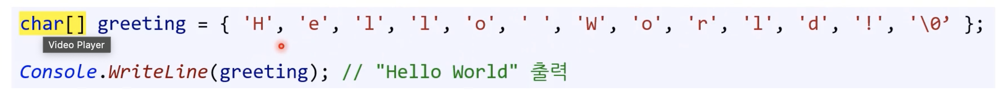

### 더하기

두 문자열 더하기는 가능하다. 두 문자열을 합쳐서 하나로 만든다.
문자열과 숫자를 더하면 문자열이 된다.
"Hello" + 12345 = "Hello12345"

### 빼기, 곱하기, 나누기

불가능하다. 궁금하면 해보세요.. `컴파일 오류`가 납니다.

### 비교 : 두 문자열이 같은지 확인하기

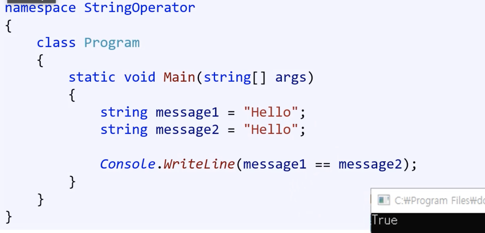
프로그래밍 언어마다 다르게 작동한다. Java의 경우 reference로 비교하기 때문에 다르다고 나와요..

### 큰 따옴표 출력하기

"""를 출력하려면 컴파일러가 인식하지 못해서 컴파일 오류가 발생한다. 따라서 문법에서 탈출하는 방법이 필요하죠! 역 슬래시로 문법에서 탈출할 수 있습니다.
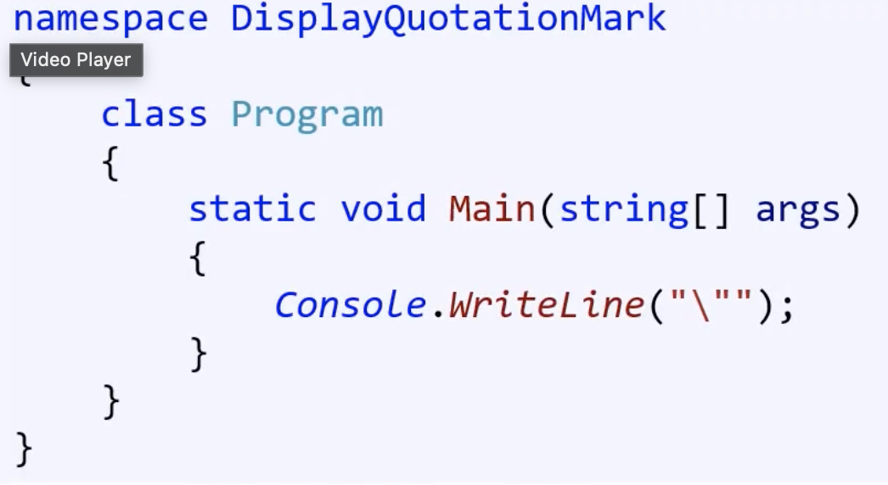

### 이스케이프 문자(Escape Sequence)

역 슬래시로 시작하는 특수문자다.

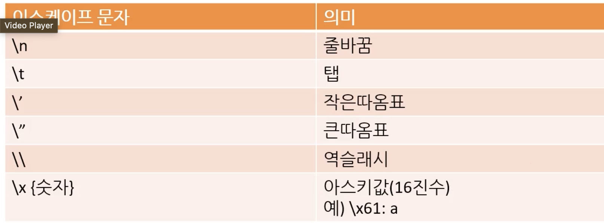

0x61는 6\*16 + 1이니까 십진수 97이죠? 소문자 a입니다.

```<C#>
Console.WriteLine("\x48\x65\x6C\x6C\x6F\x20\x57\x6F\x72\x6C\x64\x21");
```

## 문자열 포메팅

### + 기호를 이용한 포메팅

`+`연산자를 이용해서 문자열을 만들 수 있다. 예를 들어 문자열 + 정수형도 되고 부동소수점형 + 문자열도 되고 등등 아래 사진을 참고하자.

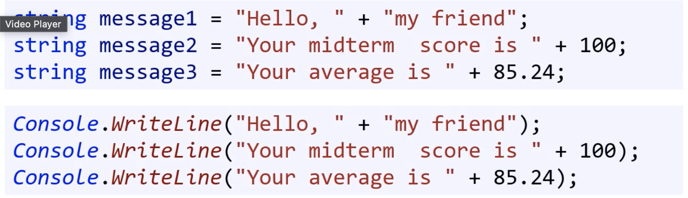

하지만 이 방법은 단점이 있다. 우선 성능 이슈가 있다. 더할 때 임시문자열이 생성되는데 이게 많아지면 성능에 좋지 않다. 그리고 코드의 가독성이 별로다.

### Format 함수를 이용한 포메팅

포멧의 뜻은 서식에 맞춰서 무엇을 만들다라는 뜻이 있다. 소괄호 안의 함수인자의 데이터를 서식에 맞춰서 문자열을 만들어준다.

```<C#>
stirng message = string.Format("Name: {0} / ID: {1}", name1, id1);
```

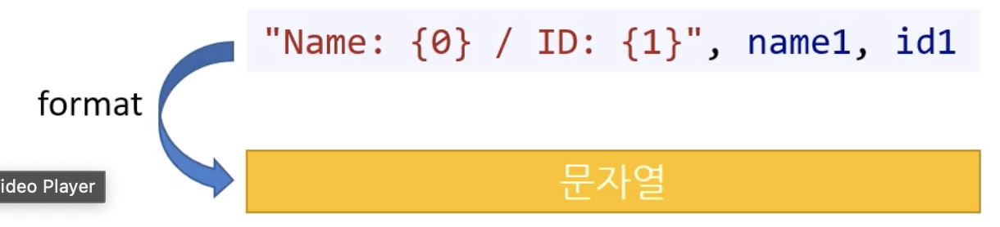

지금 주목해야 할 점이 있다. string이라는 자료형의 변수 message에 대입을 했다?! 잠깐 메인 함수를 떠올려보자. 모든 함수는 반환형을 가진다고 했다. 메인 함수는 반환형이 void이다. 즉 main 함수가 return 한 값을 어디에 대입할 수 없다. 하지만 string이 반환형이라면 string 변수에 대입할 수 있겠죠? `Format함수는 string을 반환합니다.` 즉 서식에 맞춰서 문자열을 만들어서 반환하는거죠!

두번째 주목할 점은 {0}, {1}같은 숫자들입니다. 인덱스라고 부릅니다. 이를 통해서 공통된 부분을 인덱싱하고 인덱스에 원하는 값을 넣어서 문자열을 만들 수 있습니다.

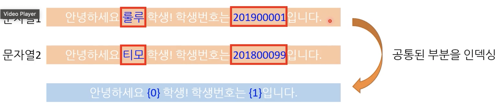

```<C#>
string name = "lulu";
int id = 201900001;
string.format("안녕하세요 저는{0}입니다. 학번은 {1}입니다", name , id);
```

이 방식이 가독성이 좋습니다.

#### 이 방식은 Console.WriteLine 함수에도 쓸 수 있다.

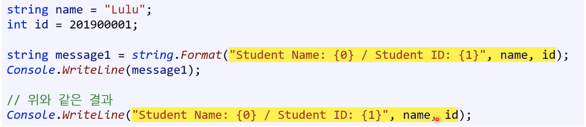

#### {0}을 2번쓰면? 즉 같은 인덱스를 여러번 쓰면?

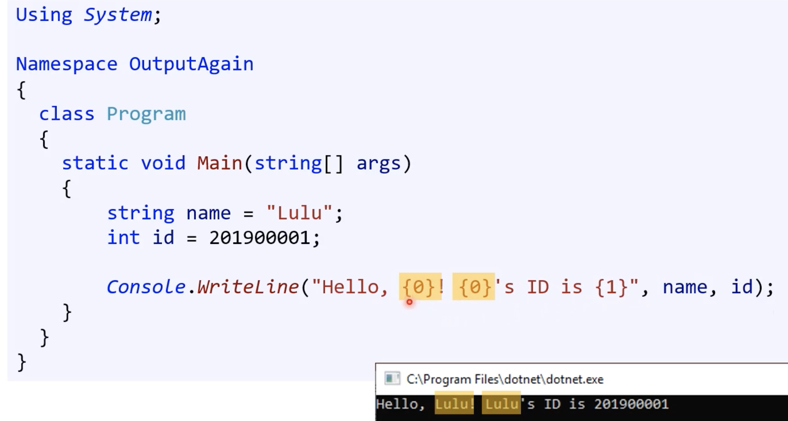
인덱스에 해당하는 함수 인자가 여러번 출력된다.

### 예쁘게 정렬하기

참고로 한글을 들여쓰기할 때 스페이스바 2번해줘야한다. 영어 2글자가 한글 1글자라서 그렇다.

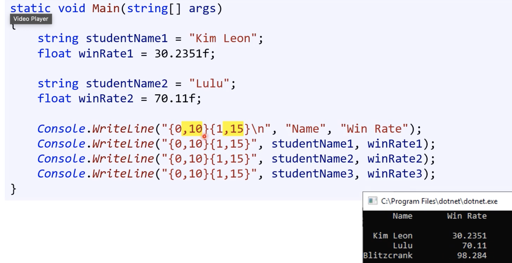

{}안에 2번째 숫자로 이 글자가 몇 칸을 차지할 지 입력할 수 있다. 이 칸 수(10, 15)보다 작으면 공백이 왼쪽에 들어가서 `오른쪽 정렬`이 된다.

이 정렬 길이만 조절해서 재사용성을 높일 수 있다.

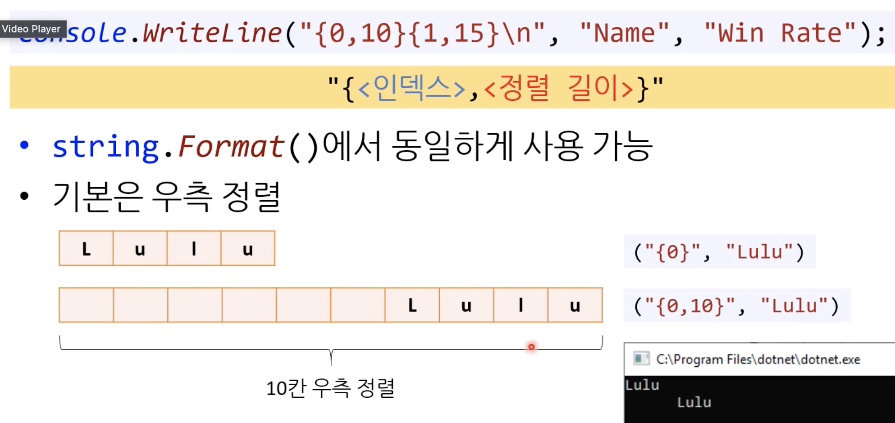

`왼쪽 정렬`을 하고 싶으면 정렬 길이에 값에 `음수`를 넣으면 된다.

### 소수점 n자리까지 출력하기

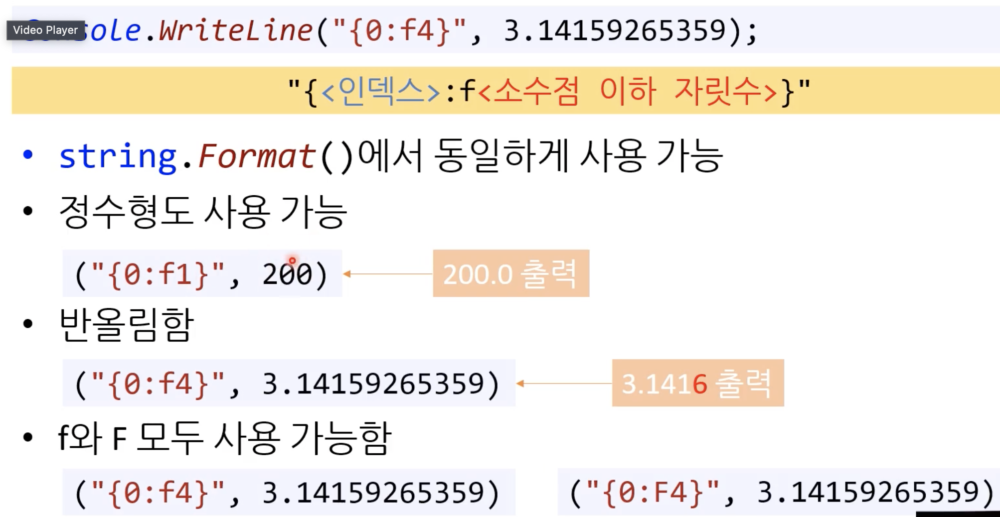
데이터 값은 바꾸지 않고 서식만 바꾸는 방법이다. `:f<자리수>` 원래 수의 자리수가 format함수의 인자로 들어가는 자리수보다 크다면 반올림된다. (언어마다 다르긴 함)
`정수형도 사용 가능하다는 것은 값이 부동소수점형으로 바뀌는 것이 아니라 서식만 소수점을 표기한다.`

### 10진수를 16진수로 출력하기

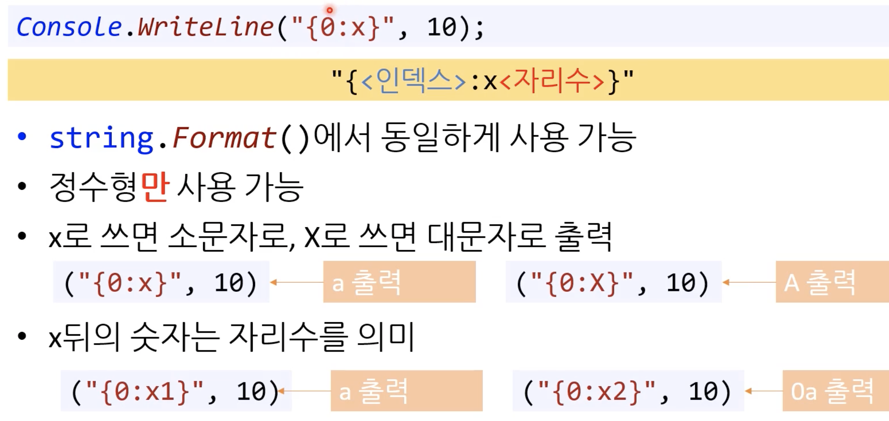
서식으로 진수를 변환해서 출력한다. `정수형만 사용가능하다.` 이건 왜 그러냐면 기본적으로 진법 변환이 정수체계에서 이뤄진다. 물론 수학에서 부동소수점도 진법 확장 할 수 있는데 보통 프로그래밍 언어에서 잘 지원하지 않는다.

16진수의 표기하는 수에 알파벳이 포함되어 있기 때문에 소문자, 대문자를 구분할 수 있는 기능이 있다. x뒤의 숫자는 자리수를 의미한다. 빈 자리는 0으로 채운다.

### 최신 포메팅 방법 : 문자열 보간(string initerpolation)

문자열 보간(수학에서 나온 개념)이라고 부른다. 이걸 사용하려면 "$"를 붙이면된다. 대체될 문자열을 "{<변수명>}" 으로 변수명을 바로 넣어서 사용할 수 있다.

`달러 사인은 큰 따옴표 밖에 써준다`는것 기억하자!

```<C#>
string name = "lulu";
int id = 20190101;
$"안녕하세요 저는 {name}입니다. 학번은 {id}입니다."
```

이게 가독성도 제일 좋고 실수할 확률도 낮다.

```<C#>
int num1 = 48;
int num2 = 65;

Console.WriteLine($"The sum of {num1} and {num2} is {num1 + num2}");
```

이렇게 num1 + num2 라는 `수식 자체를 넣어도` 값을 계산해서 문자열을 만들어준다.

### @ : 이스케이프 방지

앞서 특수문자를 출력할 때 역슬래시`\`를 넣어서 이스케이프 했었다. 문자열 큰 따옴표 앞에 골뱅이를 넣으면 이 이스케이프를 무시한다. 즉 적은 그대로 출력해주는 것이다.


## 키보드 입력

### Console.ReadLine 함수

ReadLine은 영어로 한 줄을 읽다라는 뜻이죠? Console은 명령프롬프트 입니다. 따라서 명령프롬프트에서 한 줄을 읽는다라는 뜻을 가집니다. 대부분 유저는 키보드로 입력하기 때문에 키보드 입력을 받는 함수로 압축해서 기억하면 되겠습니다.

반환형은 string입니다. string이 문자, 숫자를 모두 담을 수 있는 포괄적인 상위 개념(?)의 자료형이기 때문입니다. "123"이렇게 문자열 안에 숫자 가능한 것은 이미 확인했습니다.
결론적으로 `문자열로 읽을 수 밖에 없다`는 제약이 생겼습니다.

기본적으로 Console.ReadLine에서 말하는 한 줄은 엔터키를 기준으로 합니다. 명령 프롬프트에 입력하고 엔터를 딱 치는 순간 ReadLine에서 읽게됩니다.

### 키보드의 입력을 문자열이 아닌 숫자 자료형으로 변형하자

#### 암시적 변환으로 변형이 될까?

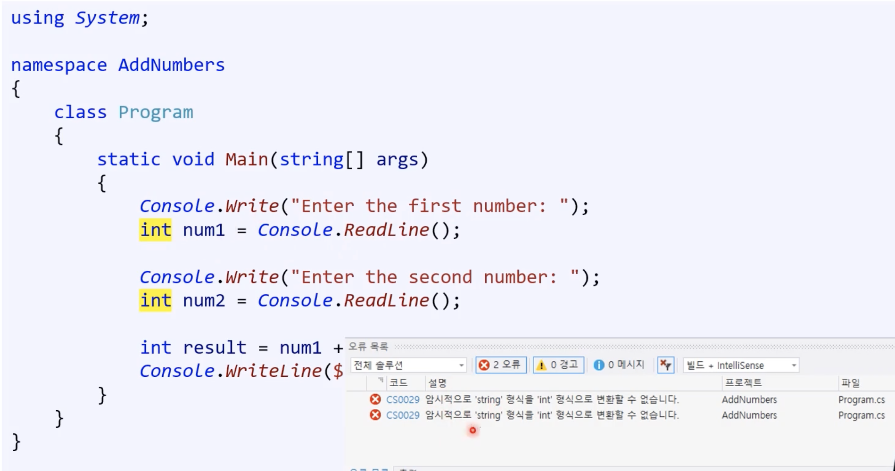

안 된다. `암시적 변환의 조건`을 생각해보자. 기본 자료형끼리 변환을 컴파일러가 알아서 해주는데 string은 기본 자료형이 아니죠? 따라서 암시적 변환이 실패하고 `컴파일 오류`가 발생한다.

#### 명시적 변환으로 변형이 될까?

안 된다. 컴파일러(컴퓨터)는 그렇게 똑똑하지 않다. 문자가 촘촘히 나열되어있는 어떤 것을 바로 숫자로 바꿀 수 없다. 마찬가지로 `컴파일 오류`가 발생한다.

#### 파싱

parsing을 하면 된다. 함수는 Parse인데 함수 인자로 들어온 문자열을 해석, 번역하는 함수다.

```<C#>
int result = int.Parse("123");
```

이런식으로 변형이 가능하다. 다만 문자열이 숫자값을 가지지 않는 경우 예외가 발생한다. 예를들어 "ABCD"이런거 숫자로 변형 못한다. 참고로 예외는 `실행 중 오류(런타임 오류)`라고 생각하면 된다. 컴파일 오류가 아니다!
